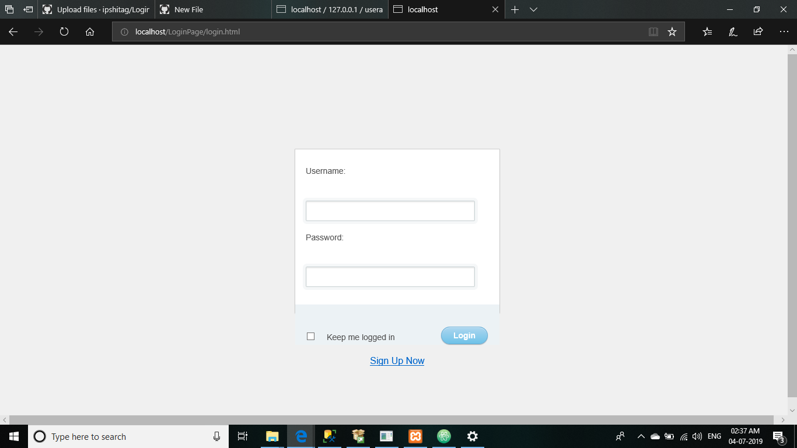

# LoginPage
 simple login page
 
 # Screenshots

.png)

.png)
The fields are set to be "required"

.png)
When values are entered

.png)
On a successful save
:tada:  :trollface:  :hatching_chick:

.png)
Saved in the SQL table
:tada:

## Feel FREE to make any contributions :squirrel:
